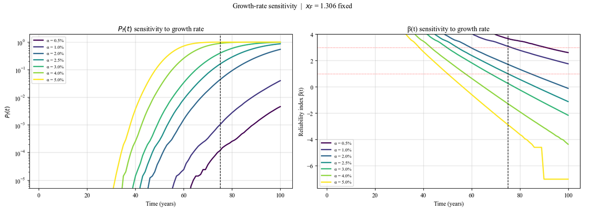
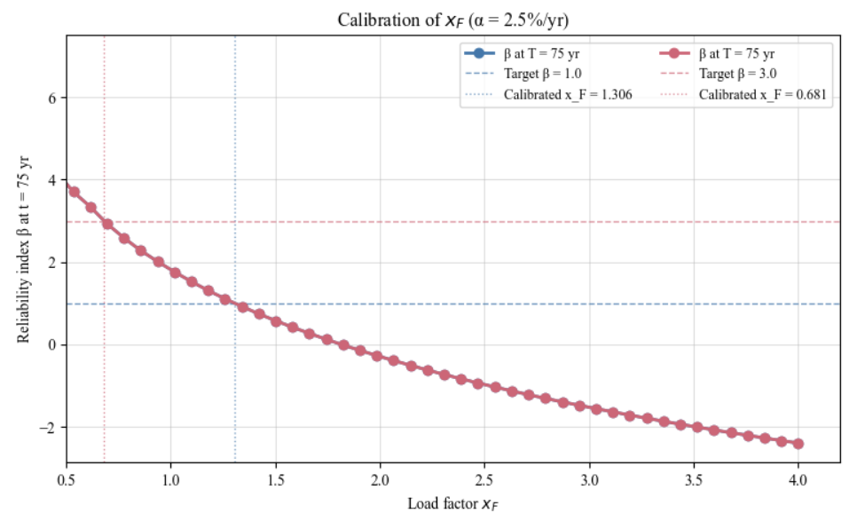
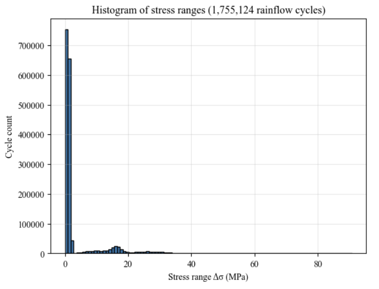

# Fatigue Load Factor Calibration 

Reliability-based calibration of the fatigue load factor for a Mexican steel bridge, with the annual traffic growth rate treated as an explicit input. This code simulates one year of traffic loading on the bridge, computes rainflow stress cycles, accumulates Palmgren-Miner damage under both Eurocode and AASHTO S-N conventions, and evaluates a probabilistic limit state by direct Monte Carlo to solve for the load factor that meets a target reliability at a specified design period.

Run `main.ipynb` end-to-end; automatically imports the other notebooks (`sample_vehicle`, `simulate_midspan_moment`, `moment_to_stress`, `rainflow`, `sn_curve`, `miner_damage`, `monte_carlo_failure`, `traffic_growth_calibration`) and produces the calibration outputs reported in the article.

Companion code to *Reliability-Based Calibration of Fatigue Load Factors for Steel Bridges Under Traffic Growth Uncertainty* (Barragán, 2026).

## Selected outputs

**Growth-rate sensitivity** — reliability index β(t) under the calibrated load factor across the full range of growth rate scenarios.

**Calibration curve** — reliability index at the design horizon as a function of the load factor, with both targets marked.

**Stress range histogram** — one calendar year of simulated traffic, ~1.76M rainflow cycles.

